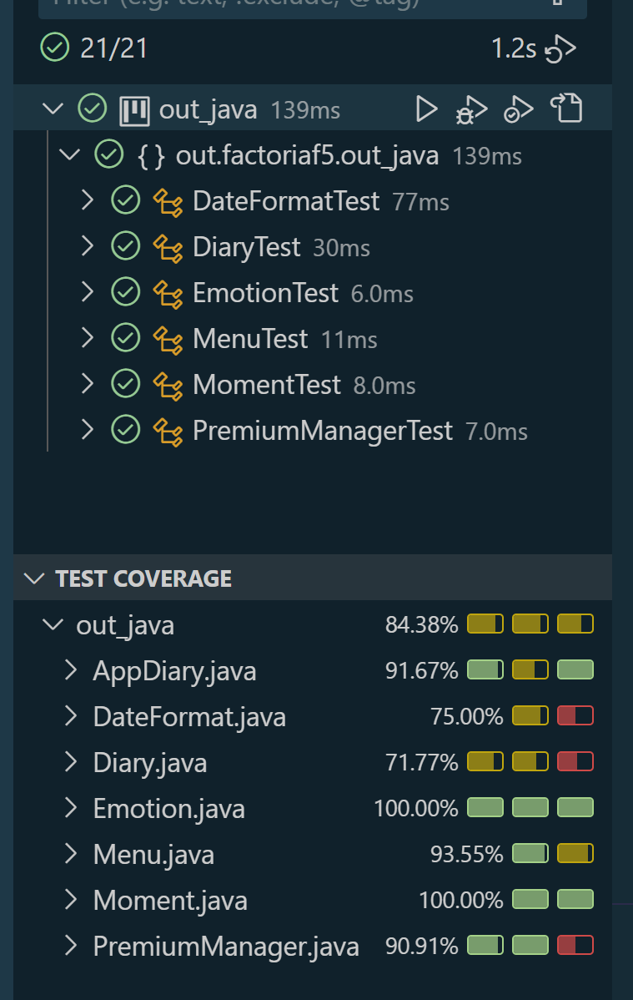
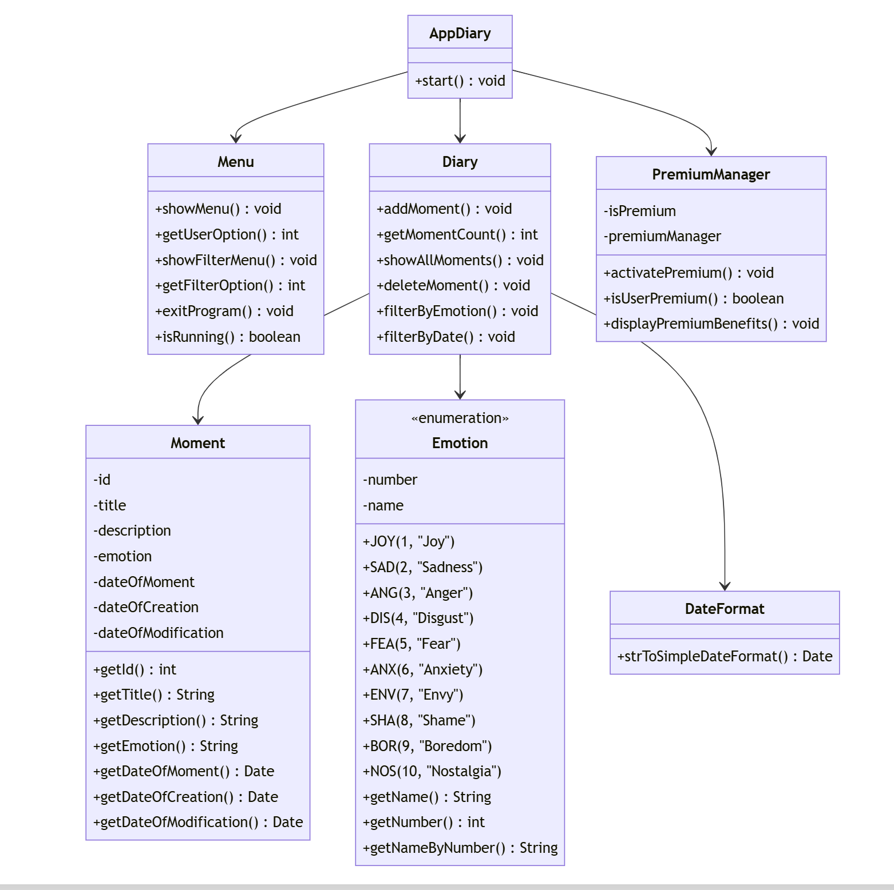

# Project-Inside-Out

# My Diary

## Project Description
"My Diary" is a console application designed to manage memorable moments, allowing the user to record emotions, specifying the date and description of their meaningful experiences related to those emotions.

## Objective
To manage memorable moments with attributes such as emotions, dates, and descriptions, facilitating their organization and display.

## Main Features
- **Main Menu**: Navigation interface to choose available actions.
- **Add Moment**: Allows the user to enter a moment with a title, description, emotion, and date.
- **View Moments**: Displays all stored moments.
- **Delete Moment**: Option to delete a specific moment.
- **Filter Moments**: Option to retrieve moments based on their emotion or a specific month.

## Prerequisites
- **Java Development Kit (JDK) 8** or higher - Required to compile and run the project.
- **Maven** - If you want to manage dependencies or compile from the command line.
- **IDE** - For better management of the project and its dependencies.

## Installation steps
1. **Clone the repository**
    ```bash
    git clone https://github.com/Snysic/Project-Inside-Out.git
    cd Project-Inside-Out
    ```

2. **Set up the project in the IDE**
    - Open the project in your preferred IDE.
    - Ensure the JDK is configured correctly.
    - Verify the `pom.xml` file is present, as well as the dependencies.

3. **Run the application**
    - Navigate to the `AppDiary` class in your IDE.
    - Run the `AppDiary` class from the IDE, or from the terminal.

4. **Menu Options**
    Within the app, you will be presented with options to manage moments and activate premium features. You can add, show, delete, and filter moments, as well as activate the premium subscription. Select the number of the option you want, which ranges from 1 to 6.

## Test Execution

In Visual Studio Code, navigate to the **Testing** section to run tests and observe code coverage. The project ensures a minimum of 70% coverage across all methods.



You can also find the test coverage image here: `images/test-cover.png`

## Diagrams



The diagram image can also be found here: `images/diagram.png`

## Business Model
The application follows a Freemium or One-Time Purchase model:
  - **Free Version**: Allows the user to add, edit, and delete up to 20 moments.
  - **Premium Version**: Allows the user to save more than 20 moments.
  - **Payment Simulation**: The application simulates payment with a console message, such as "To add more moments, acquire the premium version."

## Authors
- Angelo Colmenares
- Maria Vasilenko
- Mariel Blanco
- Nelli Yanchuk
